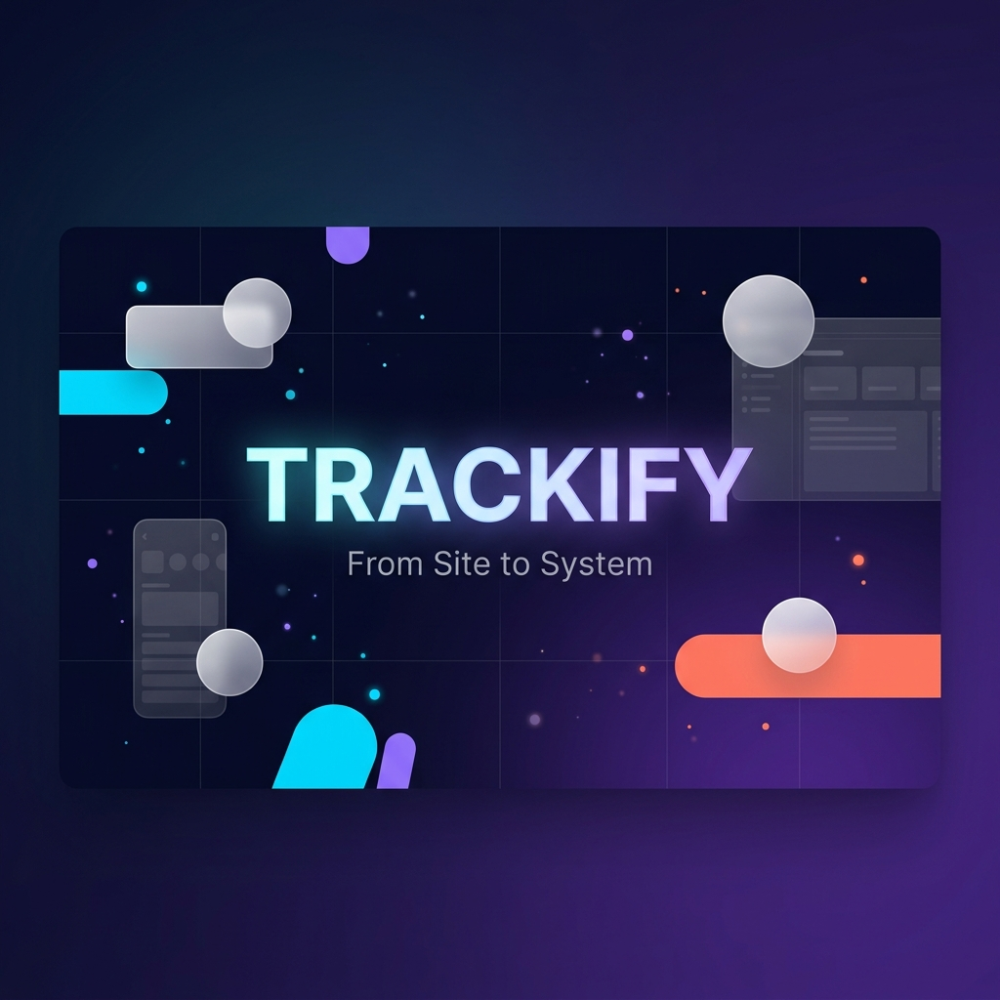
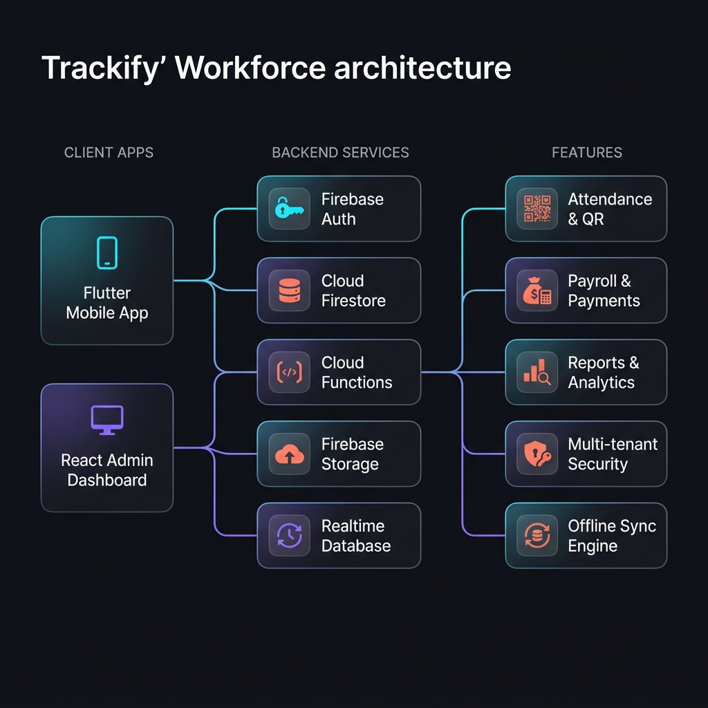

<div align="center">



<br />

# ✨ Trackify

### From Site to System — The Open-Source Workforce Intelligence Platform

[](https://flutter.dev)
[](https://react.dev)
[](https://firebase.google.com)
[](https://dart.dev)
[](LICENSE)
[](CONTRIBUTING.md)
[]()

<br />

**Trackify** is a full-stack, multi-tenant workforce management platform built for construction sites and field operations. It combines a **Flutter mobile app** for on-site supervisors with a **React admin dashboard** for contractors and super admins — all powered by **Firebase** with real-time sync, offline-first architecture, and enterprise-grade security.

<br />

[📱 Mobile App](#-mobile-app) · [🖥️ Admin Dashboard](#%EF%B8%8F-admin-dashboard--trackify-admin) · [🏗️ Architecture](#%EF%B8%8F-architecture) · [🚀 Quick Start](#-quick-start) · [📖 Docs](#-documentation) · [🗺️ Roadmap](#%EF%B8%8F-roadmap)

<br />

---

</div>

<br />

## 🪄 Why Trackify?

<table>
<tr>
<td width="50%">

### 😤 The Problem

Managing workforce attendance, payments, and site operations on paper or in spreadsheets leads to **data loss**, **payment disputes**, and **zero visibility** for contractors managing multiple construction sites.

</td>
<td width="50%">

### 😍 The Trackify Way

A beautiful, offline-first mobile app that supervisors **love** to use, paired with a powerful admin dashboard that gives contractors **complete control** — synced in real-time, secured per-tenant, and backed by Firebase.

</td>
</tr>
</table>

<br />

## ✅ Features

<table>
<tr>
<td align="center" width="33%">
<br />

<h3>Smart Attendance</h3>
<p>QR code scanning, session-based tracking, half-day/overtime support, and heatmap visualizations. Works fully offline.</p>
<br />
</td>
<td align="center" width="33%">
<br />

<h3>Payroll & Payments</h3>
<p>Auto-calculated wages, advance tracking, payment history, and bulk payroll processing with PDF/Excel exports.</p>
<br />
</td>
<td align="center" width="33%">
<br />

<h3>Reports & Analytics</h3>
<p>Daily closing reports, labour summaries, cost breakdowns, site expense tracking, and beautiful interactive charts.</p>
<br />
</td>
</tr>
<tr>
<td align="center" width="33%">
<br />

<h3>Multi-Tenant Security</h3>
<p>Role-based access (Super Admin → Contractor → Supervisor), PIN-protected actions, and per-tenant data isolation via Firestore rules.</p>
<br />
</td>
<td align="center" width="33%">
<br />

<h3>Offline-First Sync</h3>
<p>Built-in sync engine with conflict resolution. Supervisors work offline at remote sites — data syncs automatically when connectivity returns.</p>
<br />
</td>
<td align="center" width="33%">
<br />

<h3>TrackOps Console</h3>
<p>Mission dashboard, live user monitoring, error center, deployment center, security center, and product health — your internal DevOps cockpit.</p>
<br />
</td>
</tr>
</table>

<br />

<details>
<summary><strong>🔬 Even More Features</strong></summary>

<br />

| Category | Features |
|:---|:---|
| **👷 Labour Management** | Add/edit labours, contractor association, temporary labour support, labour profiles with complete history |
| **🏗️ Site Management** | Multi-site support, site-specific attendance, cost management per site, supplier & material tracking |
| **📱 QR System** | Generate QR codes for labourers, scan-to-mark attendance, QR validation with anti-tamper checks |
| **📊 Dashboards** | Real-time stats, attendance heatmaps, weekly attendance strips, today's summary cards, fl_chart visualizations |
| **💳 Cost Management** | Site expenses, material purchases, supplier management, cost simulators |
| **📋 Closing Reports** | End-of-day reports, photo attachments, supervisor notes, auto-generated summaries |
| **🔔 Notifications** | FCM push notifications, in-app notice board, version update alerts |
| **🌐 Localization** | Multi-language support with dynamic language switching |
| **🧪 Labs** | A/B testing, feature flags, beta test center, UI labs, performance lab, AI labs, experimental modules |
| **👑 Super Admin** | Customer management, subscription tracking, revenue analytics, churn analysis, growth metrics, usage analytics |
| **🎨 White-Label** | Branding setup wizard, customizable themes and logos per contractor |

</details>

<br />

## 📱 Mobile App

> **Flutter** · Dart 3.4 · Provider + Riverpod · Hive (offline) · Firebase SDK

The mobile app is designed for **on-site supervisors** and **field teams**. It works in areas with poor connectivity and syncs data when internet is available.

### Key Screens

| Screen | Description |
|:---|:---|
| **Splash & Auth** | Beautiful animated splash, phone/email auth with Firebase |
| **Dashboard** | Real-time attendance stats, summary cards, quick actions |
| **Attendance** | Session-based marking with QR scan, manual entry, half-day/OT support |
| **Labour List** | Searchable labour directory with status badges and profile cards |
| **Reports** | Monthly/daily reports with export to PDF & Excel |
| **Settings** | Language, notifications, branding, version info |
| **Calculator** | Built-in construction calculator tools |
| **Cost Management** | Track material purchases and site expenses |
| **Closing Report** | Daily site closure report with photos |

### App Architecture

```
lib/
├── main.dart                 # App entry point & Firebase init
├── core/                     # Constants, theme, utils, localization
├── models/                   # 21 data models (attendance, labour, payment, etc.)
├── providers/                # 14 state providers (Riverpod + Provider)
├── services/                 # 38 service classes (business logic layer)
├── screens/                  # Feature-organized screens with sub-modules
└── widgets/                  # 15+ reusable UI components
```

<br />

## 🖥️ Admin Dashboard — Trackify Admin

> **React 19** · Vite · TailwindCSS 4 · Shadcn/UI · Zustand · React Query · Recharts

A full-featured web admin panel for **contractors**, **super admins**, and **TrackOps operators**.

### Dashboard Modules

<table>
<tr>
<td width="50%">

#### 📊 Contractor Panel
- **Dashboard** — Live stats & analytics
- **Attendance** — Review & manage records
- **Labours** — Full CRUD with profiles
- **Payments** — Payment history & processing
- **Payroll** — Bulk payroll management
- **Reports** — Comprehensive analytics
- **Site Costs** — Expense tracking
- **Sites** — Multi-site management
- **Supervisors** — Team management
- **Settings** — Configuration & branding

</td>
<td width="50%">

#### 🛡️ TrackOps (Internal)
- **Mission Dashboard** — System overview
- **Live Users** — Real-time monitoring
- **Error Center** — Error tracking & triage
- **Deployment Center** — Release management
- **Security Center** — Threat monitoring
- **Product Health** — System metrics
- **Usage Analytics** — Feature adoption
- **Support Center** — Ticket management
- **Remote Actions** — System commands
- **Roadmap** — Feature planning

</td>
</tr>
</table>

#### 👑 Super Admin Suite
> Revenue analytics · Customer profiles · Subscription management · Churn analysis · Growth metrics · User management · Feature analytics · Usage insights · Support escalation

#### 🧪 Labs
> A/B Testing · Feature Flags · Beta Test Center · Cost Simulator · Performance Lab · AI Labs · UI Labs · Internal Notes · Release Center · Feature Requests

<br />

## 🏗️ Architecture

<div align="center">



</div>

<br />

### Tech Stack

<table>
<tr>
<td align="center" width="20%"><strong>📱 Mobile</strong></td>
<td align="center" width="20%"><strong>🖥️ Web</strong></td>
<td align="center" width="20%"><strong>☁️ Backend</strong></td>
<td align="center" width="20%"><strong>🔧 Tooling</strong></td>
<td align="center" width="20%"><strong>📦 Infrastructure</strong></td>
</tr>
<tr>
<td align="center">
Flutter 3.24<br/>
Dart 3.4<br/>
Provider<br/>
Riverpod<br/>
Hive
</td>
<td align="center">
React 19<br/>
Vite 8<br/>
TailwindCSS 4<br/>
Shadcn/UI<br/>
Recharts
</td>
<td align="center">
Firebase Auth<br/>
Cloud Firestore<br/>
Cloud Functions<br/>
Firebase Storage<br/>
RTDB
</td>
<td align="center">
Zustand<br/>
React Query<br/>
Zod<br/>
React Hook Form<br/>
Lucide Icons
</td>
<td align="center">
FCM Push<br/>
App Check<br/>
Vercel<br/>
Firebase Hosting<br/>
Node.js 18
</td>
</tr>
</table>

### System Design Highlights

```
┌─────────────────────────────────────────────────────────────────┐
│                        TRACKIFY PLATFORM                         │
├─────────────────┬──────────────────┬────────────────────────────┤
│   Flutter App   │  React Dashboard │    Cloud Functions (API)   │
│   (Supervisor)  │  (Admin/Ops)     │    (Background Jobs)       │
├─────────────────┴──────────────────┴────────────────────────────┤
│                    Firebase Services Layer                        │
│  ┌──────────┐ ┌──────────────┐ ┌─────────┐ ┌────────────────┐  │
│  │  Auth    │ │  Firestore   │ │ Storage │ │ Realtime DB    │  │
│  │  (RBAC)  │ │  (Primary)   │ │ (Files) │ │ (Live Status)  │  │
│  └──────────┘ └──────────────┘ └─────────┘ └────────────────┘  │
├──────────────────────────────────────────────────────────────────┤
│                    Security & Rules Layer                         │
│  • Per-tenant data isolation    • Role-based Firestore rules     │
│  • PIN verification             • App Check validation           │
│  • Request origin validation    • Rate limiting                  │
└──────────────────────────────────────────────────────────────────┘
```

<br />

## 🚀 Quick Start

### Prerequisites

| Tool | Version | Install |
|:---|:---|:---|
| Flutter | ≥ 3.24.0 | [flutter.dev/docs/get-started](https://flutter.dev/docs/get-started/install) |
| Node.js | ≥ 18.0 | [nodejs.org](https://nodejs.org) |
| Firebase CLI | Latest | `npm install -g firebase-tools` |

### 1️⃣ Clone the Repository

```bash
git clone https://github.com/YourUsername/YS-Trackify.git
cd YS-Trackify
```

### 2️⃣ Setup Firebase

```bash
# Login to Firebase
firebase login

# Initialize your project (select Firestore, Functions, Storage)
firebase init

# Deploy security rules & indexes
firebase deploy --only firestore:rules,firestore:indexes,storage
```

### 3️⃣ Run the Mobile App (Flutter)

```bash
# Install dependencies
flutter pub get

# Run on connected device or emulator
flutter run
```

### 4️⃣ Run the Admin Dashboard (React)

```bash
# Navigate to admin directory
cd Trackify_Admin

# Install dependencies
npm install

# Create .env file with Firebase config
cp .env.example .env

# Start development server
npm run dev
```

### 5️⃣ Deploy Cloud Functions

```bash
cd functions
npm install
firebase deploy --only functions
```

<br />

## 📁 Project Structure

```
YS-Trackify/
│
├── 📱 lib/                          # Flutter mobile app
│   ├── main.dart                    # Entry point
│   ├── core/                        # Theme, constants, utils
│   │   ├── constants/               # App-wide constants
│   │   ├── theme/                   # Material theme configuration
│   │   ├── localization/            # i18n support
│   │   └── utils/                   # Helper utilities
│   ├── models/                      # 21 Dart data models
│   ├── providers/                   # 14 state management providers
│   ├── services/                    # 38 service classes
│   │   ├── sync_engine.dart         # Offline-first sync engine
│   │   ├── auth_service.dart        # Firebase authentication
│   │   ├── attendance_service.dart  # Core attendance logic
│   │   └── ...                      # 35 more services
│   ├── screens/                     # UI screens (11 modules)
│   └── widgets/                     # Reusable components
│
├── 🖥️  Trackify_Admin/              # React admin dashboard
│   ├── src/
│   │   ├── App.jsx                  # Root component & routing
│   │   ├── components/              # Shared UI components
│   │   │   ├── ui/                  # Shadcn/UI primitives
│   │   │   ├── layout/              # Shell, sidebar, navbar
│   │   │   └── shared/              # Error boundary, etc.
│   │   ├── pages/                   # 17 page components
│   │   │   ├── trackops/            # 11 internal ops pages
│   │   │   ├── superadmin/          # 12 super admin pages
│   │   │   └── labs/                # 12 experimental features
│   │   ├── hooks/                   # Custom React hooks
│   │   ├── store/                   # Zustand state stores
│   │   ├── context/                 # React context providers
│   │   └── lib/                     # Utility functions
│   └── vite.config.js               # Vite configuration
│
├── ☁️  functions/                    # Firebase Cloud Functions
│   ├── index.js                     # Function definitions
│   └── package.json                 # Dependencies
│
├── 🔐 firestore.rules               # 334-line security rules
├── 🔐 storage.rules                 # Storage security rules
├── 📇 firestore.indexes.json        # Composite indexes
└── ⚙️  firebase.json                # Firebase project config
```

<br />

## 🔐 Security Model

Trackify implements a **defense-in-depth** security model:

```
👑 Super Admin          — Full platform access, all tenants
  └── 🏢 Contractor     — Own tenant data only (multi-tenant isolation)
       └── 👷 Supervisor — Scoped to assigned sites within tenant
            └── 📱 Labour Mode — Read-only attendance view
```

| Layer | Implementation |
|:---|:---|
| **Authentication** | Firebase Auth (Email/Phone) with custom claims |
| **Authorization** | 334-line Firestore security rules with helper functions |
| **Tenant Isolation** | `contractorId`-based data partitioning in every query |
| **PIN Security** | Supervisor-level PIN verification for sensitive actions |
| **App Check** | Firebase App Check to prevent unauthorized API access |
| **Error Logging** | Centralized error logging with telemetry service |

<br />

## 🗺️ Roadmap

<table>
<tr>
<td>

### 🟢 Completed (v2.0)
- [x] Multi-tenant architecture
- [x] QR attendance system
- [x] Offline-first sync engine
- [x] React admin dashboard
- [x] TrackOps console
- [x] Super admin suite
- [x] Labs & experimentation
- [x] FCM notifications
- [x] PDF/Excel exports
- [x] Cost management

</td>
<td>

### 🔵 In Progress
- [ ] AI-powered attendance anomaly detection
- [ ] Location-based attendance verification
- [ ] Biometric integration (fingerprint)
- [ ] Advanced analytics & ML insights
- [ ] Contractor mobile companion app
- [ ] WhatsApp notifications integration

</td>
<td>

### 🟣 Planned
- [ ] GraphQL API layer
- [ ] Progressive Web App (PWA)
- [ ] Multi-language voice commands
- [ ] Automated payroll compliance
- [ ] Third-party ERP integration
- [ ] Self-hosted deployment option

</td>
</tr>
</table>

<br />

## 📖 Documentation

| Document | Description |
|:---|:---|
| [**Quick Start**](#-quick-start) | Get up and running in 5 minutes |
| [**Architecture**](#%EF%B8%8F-architecture) | System design & tech stack overview |
| [**Security Model**](#-security-model) | Authentication, authorization & tenant isolation |
| [**Project Structure**](#-project-structure) | Codebase organization & file layout |
| [**Firestore Rules**](firestore.rules) | 334 lines of battle-tested security rules |
| [**Firebase Config**](firebase.json) | Cloud Functions, Firestore & Storage setup |

<br />

## 🤝 Contributing

We love contributions! Trackify is built by the community, for the community.

```bash
# 1. Fork the repository
# 2. Create your feature branch
git checkout -b feature/amazing-feature

# 3. Commit your changes
git commit -m "feat: add amazing feature"

# 4. Push to the branch
git push origin feature/amazing-feature

# 5. Open a Pull Request
```

### Contribution Areas

| Area | Tech | Good First Issues |
|:---|:---|:---|
| 📱 Mobile App | Flutter/Dart | UI improvements, new widgets |
| 🖥️ Admin Dashboard | React/Vite | New pages, chart visualizations |
| ☁️ Cloud Functions | Node.js | API endpoints, scheduled tasks |
| 🔐 Security Rules | Firestore | Rule optimization, edge cases |
| 📖 Documentation | Markdown | Guides, tutorials, translations |

<br />

## 👨‍💻 Author

<table>
<tr>
<td align="center">

### Tanvir Patel

**B.Tech IT Student · Flutter Developer · Full-Stack Builder**

Building Trackify to solve real-world workforce management challenges for construction companies.

[](https://github.com/YourUsername)

</td>
</tr>
</table>

<br />

## ⭐ Star History

If Trackify helps you or your organization, consider giving it a **⭐** — it means the world to us and helps others discover the project!

<br />

---

<div align="center">

<br />

**Built with 💜 and lots of ☕ by [Tanvir Patel](https://github.com/YourUsername)**

<sub>Trackify — From Site to System · Made in India 🇮🇳</sub>

<br />
<br />

[](https://flutter.dev)
[](https://react.dev)
[](https://firebase.google.com)

</div>
